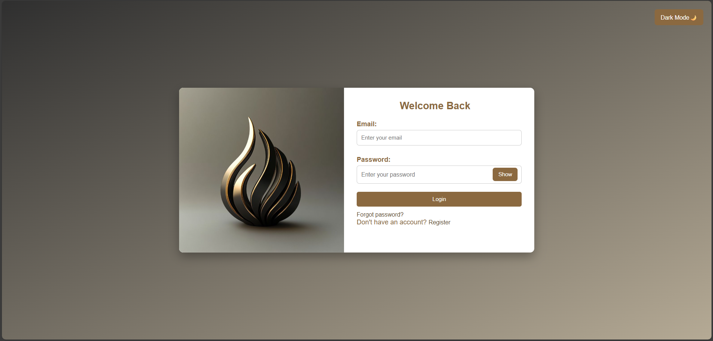
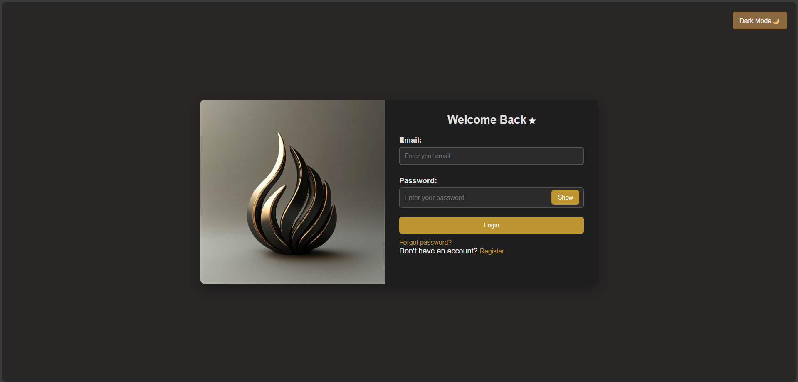
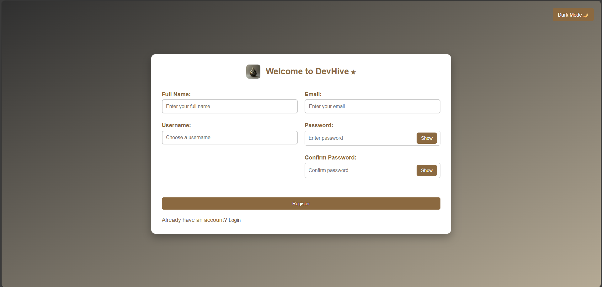
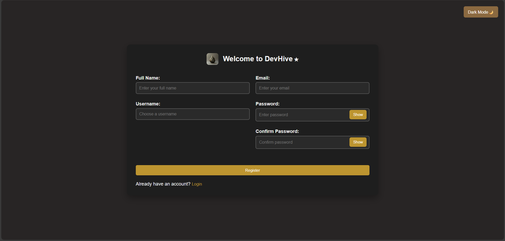
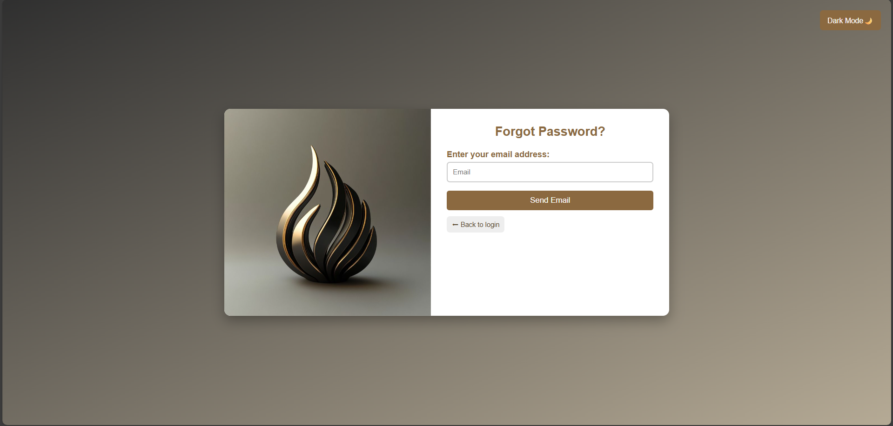
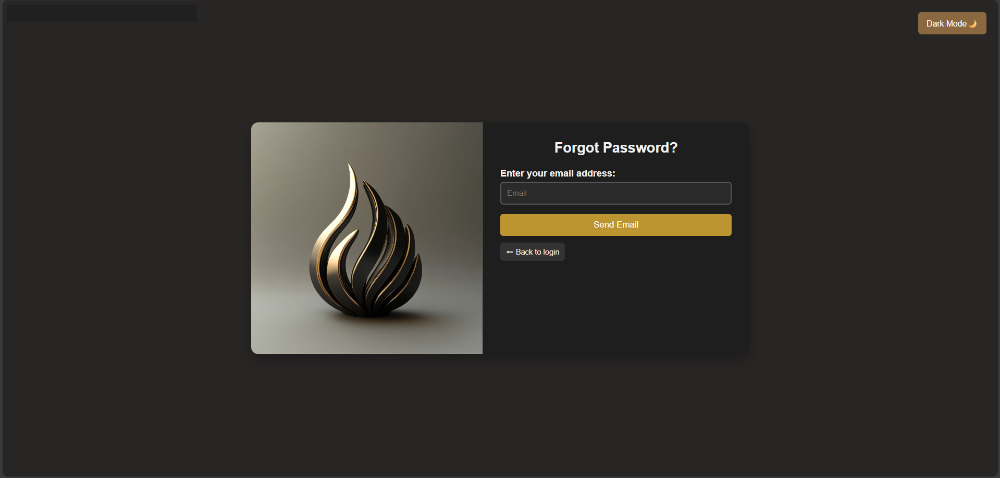
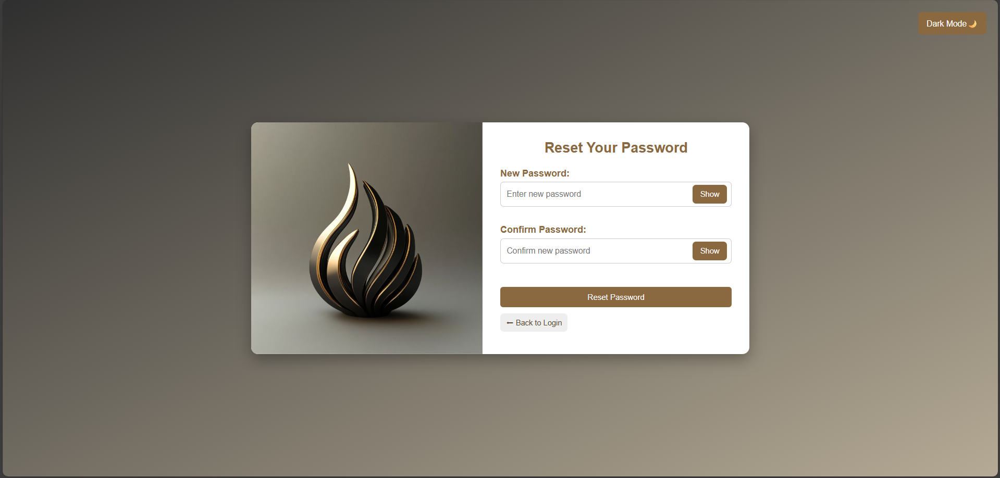
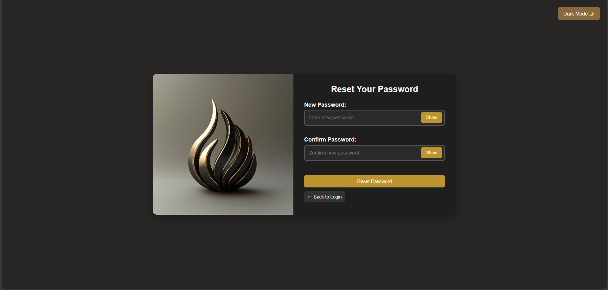
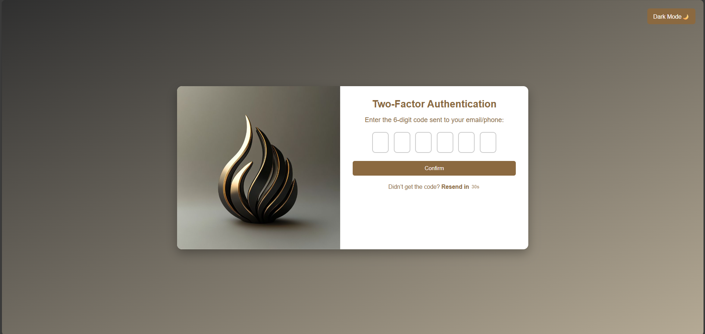
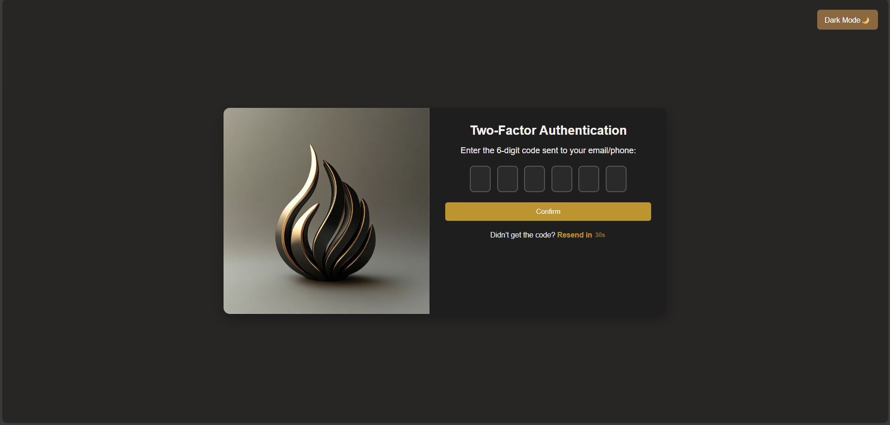

# Auth Pages UI (HTML, CSS)

A clean and responsive set of authentication pages built using **HTML**, **CSS**, and a small amount of **JavaScript** for basic interactions.

## Pages Included
- Login
- Register
- Forgot Password
- Reset Password
- Two-Factor Authentication (2FA)

## Features
- Responsive layout (works on mobile, tablet, and desktop)
- Simple and modern UI design
- Clean and organized code structure
- Easy to customize colors, fonts, and layout
- Basic form interactions (e.g. show/hide password)
```  
## Project Structure

Auth/
├─ css/
│  ├─ login.css
│  ├─ register.css
│  ├─ forget.css
│  ├─ reset.css
│  └─ two-factor.css
│
├─ html/
│  ├─ login.html
│  ├─ register.html
│  ├─ forgot-password.html
│  ├─ reset-password.html
│  └─ two-factor-authentication.html
│
├─ images/
│  └─ (logo and UI assets)
│
├─ screenshots/
│  └─ (UI preview images)
│
└─ README.md


```
## UI Preview

### Login Page

<p align="center">
  
   
</p>

### Register Page

<p align="center">
  
  
</p>

### Forgot Password Page

<p align="center">
  
  
</p>

### Reset Password Page

<p align="center">
  
    

### Two-Factor Authentication Page

<p align="center">
  
   
</p>


## How to Run
Open `login.html` inside the `html`folder in your browser.


